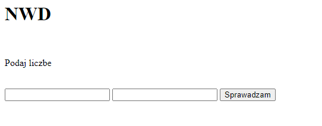

# NWD

## Table of content
* [General info](#General-info)
* [Images](#Images)
* [Technologies](#Technologies)
* [Setup](#Setup)
* [Features](#Features)
* [Status](#Status)

## General info
Simple website which allows an easy way to calculate "greatest common divisor". It was made using the JavaScript. I made it for purely educational reasons.

## Images

## Technologies
* HTML 5
* JavaScript

## Setup
As it is a HTML document all you need is a default text editor like notepad and an internet browser

## Features
* It counts greatest common divisor
To do:
* I may add some other simple calculators later

## Status
As of today the project is complete
